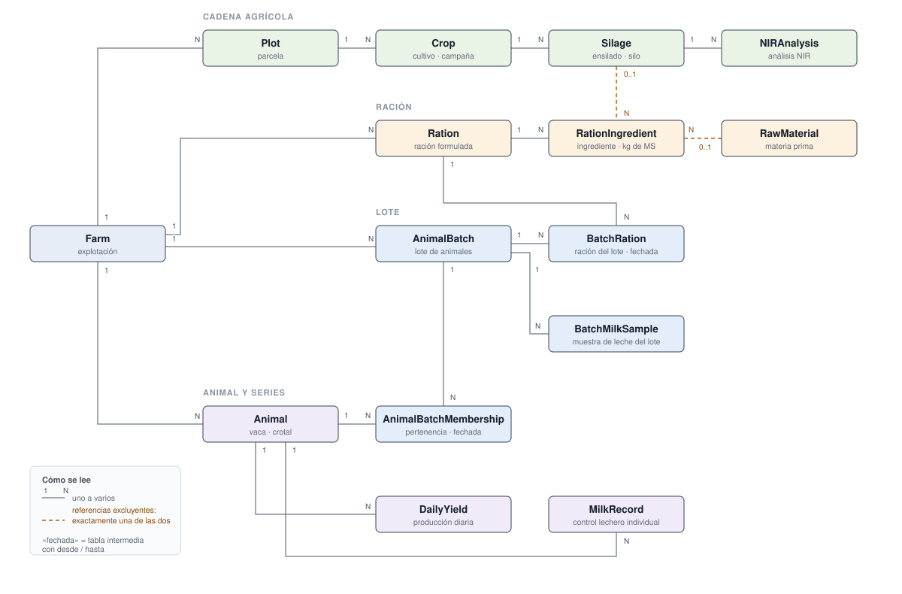
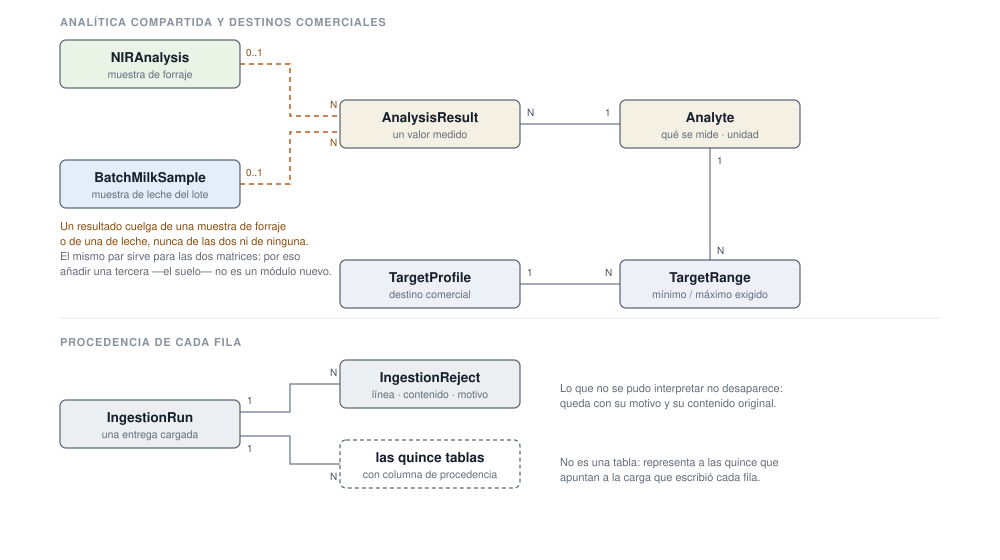
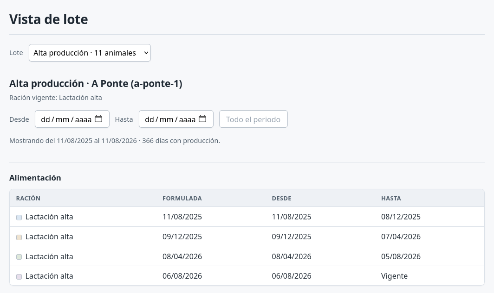
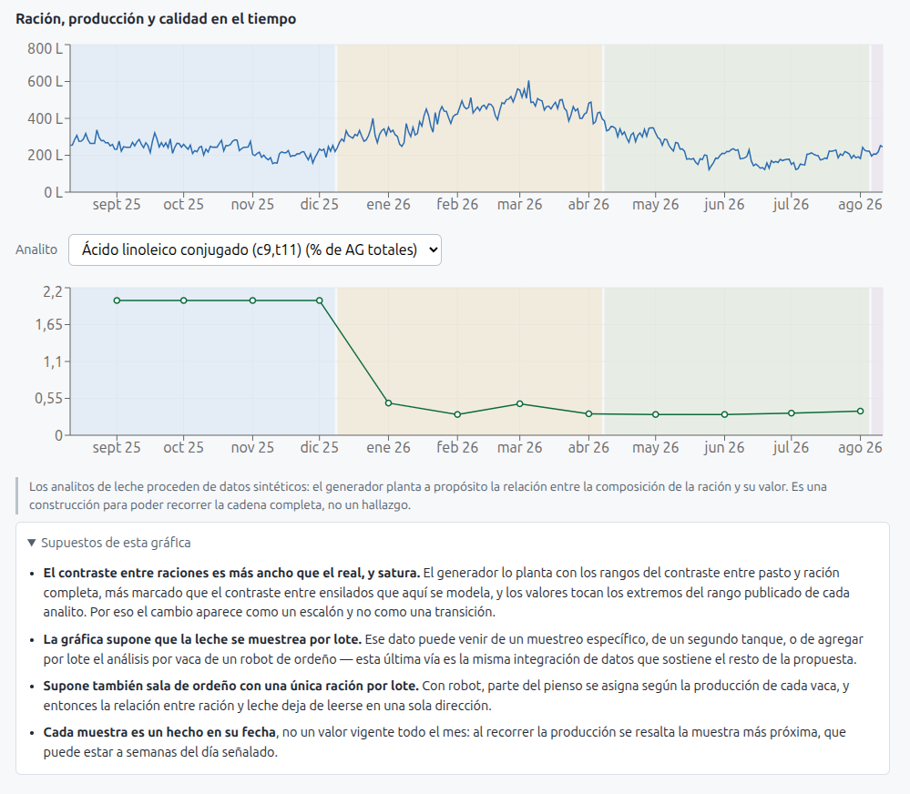
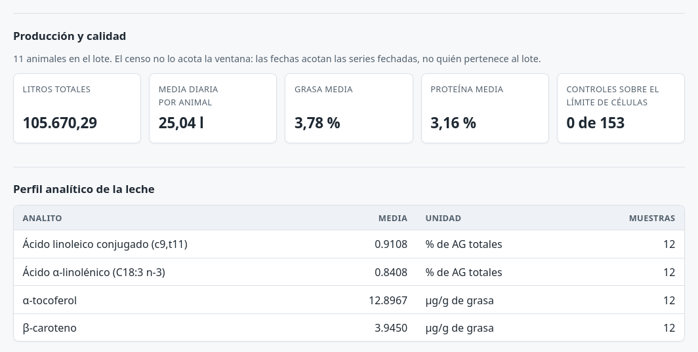
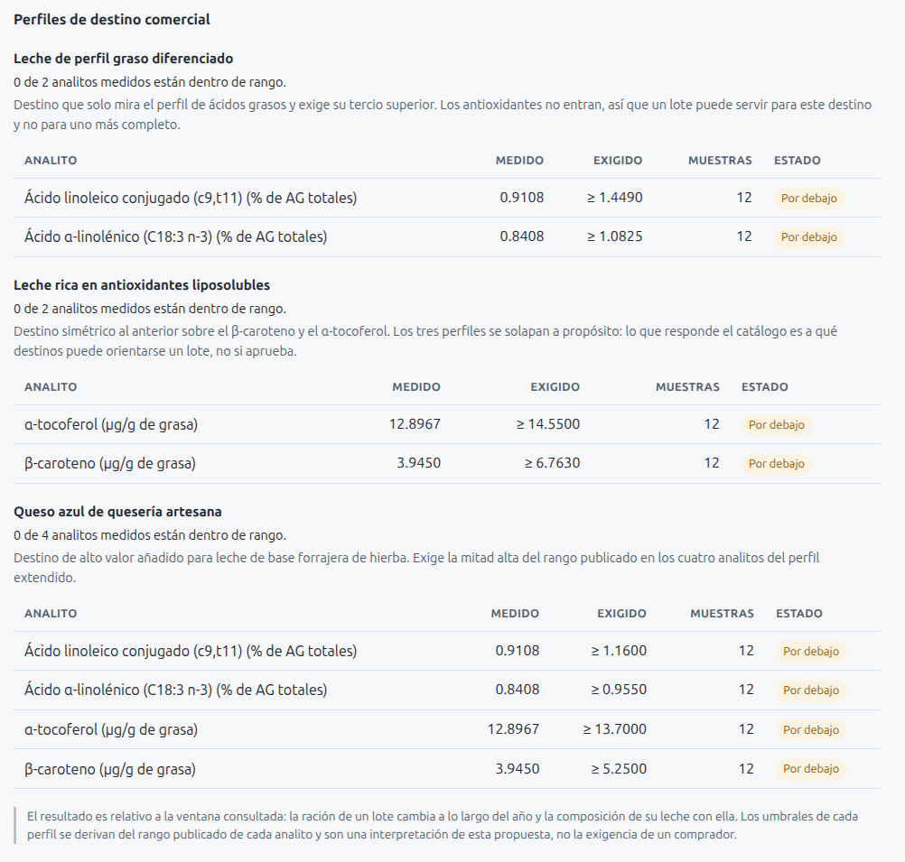

# agro-dashboard

Dashboard de producción lechera para granjas de vacuno: una API en **Django REST
Framework** sobre **PostgreSQL** con datos realistas, y un frontend en **React**
que los visualiza. Lo que demuestra el proyecto es una **línea continua de datos
desde la parcela de cultivo hasta la calidad de la leche**, entrando por cinco
formatos de origen distintos y saliendo por una sola pantalla.

> **Estado.** El recorrido está completo de la base de datos a la pantalla:
> modelo de datos, generador reproducible, ingesta multifuente con procedencia,
> API de lectura con endpoints agregados y un cliente web que consume la API real.
> **Queda deliberadamente fuera** —y se explica más abajo dónde toca—:
> autenticación y permisos, orquestación de las cargas, y endpoints propios para
> los modelos de la cadena agrícola que hoy no pinta ninguna pantalla.

## Dominio

El modelo cubre la línea continua que va del forraje a la leche, porque las
decisiones de alimentación se toman en un extremo y sus efectos se miden en el
otro.

**La explotación y sus animales:**

- **Granja** — la explotación.
- **Animal** — cada vaca, identificada por su crotal, perteneciente a una granja.
- **Producción diaria** — lo que produce cada animal en un día (litros).
- **Control lechero individual** — analítica mensual de cada animal: grasa y proteína (en
  porcentaje) y recuento de células somáticas (en células/ml, la unidad en la que
  el Reglamento (CE) 853/2004 fija el límite de 400.000 para la leche cruda de
  vaca; ese umbral es la base de las alertas de calidad).

**La cadena del forraje:**

- **Parcela → Cultivo → Ensilado** — la base territorial, la campaña que se
  siembra en ella y el silo que sale de esa cosecha.
- **Análisis NIR** — lo que se mide de cada silo. Los parámetros no son columnas:
  cuelgan como resultados por analito, de modo que el mismo esquema sirve para la
  analítica del forraje y para la de la leche, y añadir un parámetro no cambia el
  modelo.
- **Ración** — la formulación, con sus ingredientes en kilos de materia seca.
  Cada ingrediente es un silo propio o una materia prima comprada, nunca las dos
  cosas: la base lo impone con una restricción.

**La pieza que une las dos mitades:**

- **Lote de animales** — el grupo al que se asigna una ración. La pertenencia de
  un animal a su lote y la ración que come un lote son **relaciones fechadas**,
  así que se puede responder qué comía un animal concreto en una fecha concreta.
- **Muestra de leche del lote** — la analítica de la leche de un lote en una
  fecha: perfil de ácidos grasos y antioxidantes liposolubles, colgando del mismo
  par analito/resultado que el análisis NIR. Convive con el control lechero
  individual porque responde a otra pregunta: la ración se asigna al lote, así
  que es en el lote donde tratamiento y respuesta coinciden.

### El esquema

Los veintiún modelos y sus cardinalidades. Notación: `1`—`N` es uno a varios, y la
línea discontinua marca las dos referencias **excluyentes**, donde exactamente una
de las dos tiene valor.



Lo que este esquema muestra y la lista de arriba no puede: que las dos tablas
intermedias —pertenencia a un lote y ración del lote— **llevan fechas, y por eso
son tablas**; sin ellas el sistema solo sabría responder por el presente.

La analítica y el registro de procedencia van aparte porque no pertenecen a ninguna
de las dos mitades: el mismo par analito/resultado sirve para el forraje y para la
leche, y cada fila de hecho apunta a la carga que la escribió.



Las reglas que no deben violarse nunca —un crotal no repetido dentro de la misma
granja, un único registro de producción por animal y día, litros y porcentajes no
negativos— se declaran como restricciones en la propia base de datos, de modo que
también las respete cualquier carga masiva de datos.

Los datos son **mockeados pero realistas**: la producción sigue la curva de
lactación (pico tras el parto y descenso hasta el secado), con variación por raza
y número de partos, caída estival por estrés térmico y casos borde deliberados
(huecos, valores atípicos, nulos y bajas a mitad de serie). La composición de los
forrajes se sortea dentro de los rangos publicados en las tablas FEDNA para cada
especie, así que ningún valor cae fuera de lo publicado. Todo se genera de forma
reproducible mediante un comando de gestión, no con datos escritos a mano.

> **Una advertencia que forma parte del producto:** el generador **planta a
> propósito** una relación entre la composición de la ración y la calidad de la
> leche del lote — un forraje con más hierba y menos maíz eleva el CLA, el ácido
> α-linolénico, el β-caroteno y el α-tocoferol de la muestra. Existe para poder
> recorrer la cadena entera de extremo a extremo; **no es un hallazgo y no puede
> leerse como tal**. La dirección del efecto y el rango de cada analito están
> tomados de literatura publicada y citada en `farms/services/milk_quality.py`,
> que es el único módulo donde vive esa relación; la forma de la interpolación y
> su amplitud son una construcción de este proyecto.

## Stack

- **Backend:** Django + Django REST Framework
- **Base de datos:** PostgreSQL
- **Frontend:** React (hooks) + Recharts, con Vite como herramienta de desarrollo
- **Entorno de desarrollo:** Docker Compose (Django + PostgreSQL) y el servidor
  de desarrollo de Vite para el cliente

## Principios de diseño

- **La agregación se hace en el backend.** Medias, totales, rankings y alertas se
  calculan en el ORM y viajan ya resueltos; el frontend solo representa.
- **Los datos entran por adaptadores de fuente,** uno por sistema de origen, y
  salen todos con la misma forma canónica. Hoy son cinco —robot de ordeño, núcleo
  de control lechero, cuaderno de campo, laboratorio de análisis de forrajes y
  laboratorio de análisis de leche—, cada uno con su formato, su manera de
  escribir una fecha, su codificación de lo no medido y su vocabulario. Ni
  siquiera coinciden en el grano: el robot entrega una fila por ordeño donde el
  modelo guarda una por día, y el laboratorio de leche una tabla ancha con un
  analito por columna donde el modelo guarda un resultado por analito, de modo
  que reconciliarlo es trabajo del adaptador. El cargador recibe siempre la misma
  estructura y no
  ramifica por origen: sustituir una fuente mockeada por una real es reescribir
  su adaptador, no el proyecto.
- **Cada fila sabe de dónde vino.** Toda carga queda registrada con su fuente, su
  referencia de origen y sus contadores, y lo que un adaptador no supo interpretar
  se conserva con el motivo y el contenido original en vez de descartarse en
  silencio.
- **El frontend consume siempre la API real,** con estados de carga y error
  explícitos; nunca datos embebidos en los componentes.

## Puesta en marcha

Requisitos: **Docker y Docker Compose** para el backend y la base de datos, y
**Node** en la versión que fija `frontend/.nvmrc` para el cliente web (pasos 1 a 3
y paso 4, respectivamente). Para enganchar el `pre-commit` del apartado
*Desarrollo* hace falta además `uv` en el host.

1. **Configura el entorno.** La configuración sensible se lee de variables de
   entorno; `.env` no se versiona y `.env.example` sirve de plantilla:

   ```bash
   cp backend/.env.example backend/.env
   ```

   Rellena `DJANGO_SECRET_KEY` y `POSTGRES_PASSWORD` con valores url-safe:

   ```bash
   python3 -c "import secrets; print(secrets.token_urlsafe(64))"
   ```

   > Los valores no pueden contener `$`: Docker Compose interpola el contenido de
   > los ficheros `env_file` y lo trataría como una referencia a otra variable.

2. **Levanta el stack.** Construye la imagen, arranca PostgreSQL y aplica las
   migraciones:

   ```bash
   make build && make up
   ```

   La API queda en `http://localhost:8000` y el panel de administración en
   `/admin/` (necesita un superusuario:
   `docker compose run --rm web python manage.py createsuperuser`).

3. **Puebla la base de datos** con datos mockeados reproducibles:

   ```bash
   make seed
   ```

   El comando acepta `--seed`, `--farms`, `--animals-per-farm`, `--start`, `--end`
   y `--clear`. Con la misma semilla y los mismos parámetros produce siempre los
   mismos datos, y para que eso valga también entre un día y el siguiente **la
   ventana por defecto es una fecha fija**, no el día de hoy; `--start` y `--end`
   la desplazan.

   > **Resembrar sobre una base ya poblada solo es seguro si nada ha cambiado.**
   > Los datos se escriben actualizando la fila existente en lugar de duplicarla,
   > pero eso funciona porque la fila se reconoce por su clave natural, y en los
   > periodos con vigencia temporal esa clave incluye la fecha de inicio. Si esas
   > fechas se recalculan, las filas nuevas no reconocen a las viejas y la base
   > rechaza la carga. Ocurre en dos casos: al **mover la ventana**, y al **tocar
   > el generador**, porque cualquier cambio en cuántos números se piden al azar
   > desplaza la secuencia entera y la misma semilla deja de producir las mismas
   > fechas. En ambos hay que resembrar con `--clear`, y para eso está
   > `make reseed`.

   No escribe en la base directamente: genera los datos, serializa la entrega que
   exportaría cada sistema de origen, se la pasa a su adaptador y carga el
   resultado. Es el mismo recorrido que haría con ficheros reales, con el mock
   ocupando solo el lugar del sistema de origen. El resumen final detalla qué
   entró por cada fuente y cuántos registros se rechazaron.

4. **Levanta el cliente web.** Vive en `frontend/` y corre en el host, no en
   Docker. Necesita la versión de Node que fija `frontend/.nvmrc`:

   ```bash
   make front-install && make front-dev
   ```

   El cliente queda en `http://localhost:5173` (Vite usa el siguiente puerto
   libre si ese está ocupado) y **necesita el backend levantado y con datos**:
   los pasos 2 y 3 son requisito.

`make help` lista el resto de tareas: `make test`, `make lint`, `make format`,
`make migrate`, `make shell`, y las del cliente `make front-lint` y
`make front-build`.

### Cómo llega el cliente a la API

El servidor de desarrollo de Vite **reenvía todo lo que cuelga de `/api` al
backend** (`server.proxy` en `frontend/vite.config.js`). Para el navegador hay un
único origen, así que las peticiones no son de origen cruzado y no interviene
CORS: el backend no necesita cabecera alguna para servir al cliente. Es también
la forma que toma en despliegue, donde el estático y la API se sirven detrás del
mismo proxy inverso.

La raíz de la API se puede cambiar con la variable de entorno
`VITE_API_BASE_URL`, documentada en `frontend/.env.example`; sin definir vale
`/api`, que es la ruta reenviada. Vite solo expone al navegador las variables con
prefijo `VITE_`. Apuntarla a una URL absoluta sirve para servir el cliente sin
ese reenvío, pero entonces las peticiones sí son de origen cruzado y el backend
necesita cabeceras CORS, que hoy no están configuradas.

### Cómo el cliente pide los datos

El acceso a la API está partido en tres piezas con responsabilidades distintas,
y ningún componente llama a `fetch` por su cuenta:

- **`src/api/client.js` es el transporte.** Resuelve la raíz de la API, monta la
  cadena de consulta y traduce el fallo a una excepción. Hacen falta dos
  comprobaciones y no una, porque `fetch` **no rechaza la promesa ante un 404 o
  un 500**: solo rechaza si la petición no llega a completarse. El fallo de red y
  el error HTTP desembocan ambos en un `ApiError` con su `status`, de modo que
  quien consume tiene un único camino de error.
- **Un módulo por recurso** (`src/api/batches.js`) declara qué parámetros admite
  cada endpoint, en lista blanca. Añadir un filtro es un cambio deliberado y
  visible, no un efecto colateral de lo que envíe el llamante. Es además donde se
  traduce el vocabulario de la API, de modo que ningún componente escriba
  `date_from`.
- **`src/hooks/useApiResource.js` es el ciclo de vida de la petición** dentro de
  React: expone la carga, el error, el resultado y un `refetch`, y limpia el
  efecto al desmontar o al cambiar de parámetro. `src/hooks/useBatchResource.js`
  lo envuelve para los tres recursos del lote, que comparten firma: así la
  estabilización de la petición se escribe una vez y no en cada llamada.

Ese hook resuelve un problema que no es visible en el camino feliz: **una
respuesta que llega tarde no puede pintarse sobre una petición más reciente**. Al
cambiar de lote o de fechas, la petición anterior se aborta y el resultado que ya
venía en camino se descarta, porque el estado guarda junto al dato la petición
que lo produjo y solo se pinta lo que corresponde a la vigente. El aborto ahorra
red; la corrección la da esa etiqueta, no el orden de llegada. Así la pantalla
nunca muestra datos de un parámetro distinto del que indica.

Los tres estados —cargando, error y vacío— son explícitos y distintos entre sí.
El vacío lo decide cada pantalla y no el hook: "la API respondió y no hay nada"
tiene una forma distinta en un listado paginado que en una serie temporal, y
confundirlo con "aún no ha llegado nada" pintaría el mensaje de vacío durante
cada carga.

**Un fallo de carga tiene salida sin recargar la página.** Cada sección pide lo
suyo por separado, así que un error afecta solo a la suya y se reintenta desde
ella: el hook lleva un contador de intentos que forma parte de la clave del
estado, de modo que reintentar vuelve a ejecutar la petición aunque sus
parámetros no hayan cambiado, y mientras vuela la nueva se pinta la carga en
lugar del error anterior.

El cliente **no calcula**: medias, totales y conteos vienen resueltos del
backend, y la pantalla se limita a pintarlos.

### La vista de lote

La pantalla del cliente responde cuatro preguntas sobre un lote de animales: qué
come, qué produce, qué calidad de leche da y a qué destinos comerciales puede
orientarse. Se elige el lote en un desplegable agrupado por explotación —con el
código junto al nombre, porque **el nombre de una explotación no es único** y dos
homónimas quedarían fundidas en un grupo— y, opcionalmente, una ventana de
fechas.



> Las capturas de este apartado salen de los datos que produce `make seed` con la
> semilla por defecto, así que son reproducibles: mismo lote, mismas cifras. Todas
> corresponden al lote *Alta producción* de la explotación A Ponte **sin ventana de
> fechas**, es decir, sobre los doce meses completos.

Las cuatro raciones de la tabla se llaman igual y no son la misma: **reformular
crea una ración nueva en lugar de editar la vigente**, así que lo que las
distingue es la fecha de formulación. Es la razón de que la API entregue el
identificador y esa fecha además del nombre.

Cuatro decisiones de esa pantalla, que son las que explican lo que se ve:

- **La ventana acota las series fechadas, no el censo.** El número de animales
  del lote no cambia al mover las fechas, igual que en la API: preguntar cuántas
  vacas hay no es una pregunta con fecha. Bajo los controles se indica el tramo
  efectivo que se está mostrando y cuántos días con producción contiene, porque
  el rango pedido puede ser más ancho que el dato disponible.
- **Cada sección tiene su propia carga y su propio error.** Son tres peticiones
  independientes, así que un fallo al comparar con los perfiles no borra la
  producción ya pintada.
- **Un rango invertido se detiene en el cliente**, con un aviso neutro junto a
  los campos, en vez de viajar y volver como error: tecleando una fecha se pasa
  por estados incompletos que no son un fallo del sistema. La validación del
  backend sigue siendo el contrato y su error sigue teniendo camino en pantalla.
- **La comparación no emite un veredicto.** Se listan todos los perfiles con el
  detalle por analito y sus cuatro estados, donde *sin medir* se distingue
  visualmente de *por debajo*: no haber medido no es incumplir. La salvedad que
  acompaña al resultado —que depende de la ventana consultada y que los umbrales
  son una interpretación de esta propuesta, no la exigencia de un comprador— se
  pinta junto a la comparación, no solo viaja en el JSON.

#### La gráfica del hilo

Sobre un mismo eje temporal se pintan la producción diaria del lote, el analito
de leche que se elija en el desplegable y, de fondo, una banda por periodo de
ración con el color que marca también su fila en la tabla de alimentación. Es la
pantalla donde se ve si un cambio de ración va seguido de un cambio en la
composición de la leche.



En la captura se ve **el efecto tal y como es**: un escalón, no un gradiente. El
analito se mantiene pegado al techo de su rango publicado durante el primer
periodo de ración y cae al suelo en el siguiente, sin valores intermedios. Es la
consecuencia directa de cómo está plantada la relación, y por eso el aviso y los
supuestos van en la propia pantalla y no en una nota al pie: quien mire la gráfica
tiene delante a la vez el patrón y la advertencia de que el patrón está puesto ahí
a propósito.

- **Cada serie conserva su grano y por eso son dos gráficos, no dos líneas en
  uno.** La producción es diaria y la muestra de leche un hecho mensual;
  superponerlas obligaría a rellenar los días sin muestra con un valor que nadie
  ha medido. El eje horizontal es numérico —fechas como instantes— y su dominio
  se calcula sobre las dos series y se impone a los dos gráficos: así una banda
  cae en la misma posición en ambos, y el límite de un periodo de ración no
  necesita coincidir con un día que tenga producción.
- **Las dos secciones comparten una sola petición.** La gráfica y la tabla de
  alimentación salen de la misma llamada a la serie temporal del lote, que ya
  devuelve las tres series y la ventana efectiva.
- **La advertencia de dato sintético se pinta bajo la gráfica**, con el texto que
  viaja en la propia respuesta, de modo que el aviso y el dato no puedan
  separarse.
- **Los supuestos de la gráfica están a la vista** en un desplegable: que el
  contraste entre raciones lo planta el generador con rangos más marcados que los
  del contraste que se modela y que satura en los extremos del rango publicado;
  que la pantalla asume que la leche se muestrea por lote y que el rebaño se
  ordeña en sala con una única ración por lote; y que cada muestra es un hecho en
  su fecha y no un valor vigente todo el mes.

#### Las cifras y los destinos

Bajo la gráfica, el lote resumido en números y su perfil analítico medio. Todo
llega calculado del backend: la pantalla no promedia nada.



El contador de células somáticas se lee **«0 de 153»** y no «0»: sin el
denominador, un cero no distingue *ninguno supera el límite* de *no se midió*.

Y por último la comparación contra el catálogo de destinos comerciales:



Sobre los doce meses completos **el lote no alcanza ninguno de los tres destinos**,
y la captura se ha tomado así a propósito. Con una ventana de septiembre a
diciembre los mismos analitos entran en rango en los tres perfiles: la ración de un
lote cambia a lo largo del año y su leche con ella, de modo que un resultado
promediado sobre todo el año no describe ningún régimen. Es exactamente lo que
declara la salvedad del pie, y enseñar el caso favorable sin decirlo sería vender
como propiedad del lote algo que es propiedad de la ventana elegida.

## API

Todos los endpoints son de **solo lectura**: los datos entran por la capa de
ingesta, no por HTTP. La raíz `GET /api/` publica un índice navegable de los
recursos, y en desarrollo cada endpoint se puede explorar desde el navegador con
la interfaz navegable de DRF.

| Endpoint | Filtros | Ordenación (`?ordering=`) |
|---|---|---|
| `/api/farms/` | `province` | `name`, `code`, `created_at` |
| `/api/animals/` | `farm`, `breed`, `active` | `ear_tag`, `birth_date`, `lactation_number` |
| `/api/daily-yields/` | `animal`, `farm`, `date_from`, `date_to` | `date`, `liters` |
| `/api/milk-records/` | `animal`, `farm`, `date_from`, `date_to` | `date`, `somatic_cell_count`, `fat_pct`, `protein_pct` |
| `/api/batches/` | `farm` | `name`, `active_animals` |
| `/api/target-profiles/` | — | `name`, `code` |
| `/api/health/` | — | — |

Notas sobre el contrato:

- **Paginación** por número de página: la respuesta trae `count`, `next`,
  `previous` y `results`. El tamaño por defecto es de 50 registros y el cliente
  puede ajustarlo con `?page_size=`, hasta un máximo de 200.
- **Rango de fechas** cerrado por ambos extremos y con cada extremo opcional:
  `?date_from=2026-01-01&date_to=2026-01-31`.
- **`active`** no corresponde a ningún campo almacenado: se deriva de la fecha de
  baja del animal. `?active=true` devuelve los que siguen en la explotación.
- **Los valores decimales viajan como cadena** (`"liters": "28.40"`). Es el
  comportamiento por defecto de DRF y se conserva a propósito: preserva la
  exactitud de los importes, que se almacenan como decimales y no como coma
  flotante para que los agregados no dependan del orden de las filas.
- **Un valor ausente se representa como `null`,** que significa "no medido" y es
  distinto de cero. La producción diaria incluye huecos y lecturas nulas a propósito.
- **Un parámetro de consulta inválido devuelve `400`**, no un listado sin filtrar.

La producción diaria y los controles lecheros exponen el crotal y la granja de su
animal como campos planos, en lugar de anidar el objeto completo, para que un
listado extenso no repita los mismos datos en cada fila.

Ejemplo:

```bash
curl "http://localhost:8000/api/daily-yields/?farm=1&date_from=2026-01-01&date_to=2026-01-31&page_size=5"
```

### Endpoints agregados

Las medias, los totales y los conteos se calculan en la base de datos y viajan ya
resueltos, de modo que el cliente pinte sin cruzar series. Todos aceptan
`date_from` y `date_to`, que acotan **las series fechadas, no el censo**:
preguntar cuántos animales hay no es una pregunta con fecha.

| Endpoint | Qué devuelve |
|---|---|
| `GET /api/farms/summary/` | Una fila por explotación. Paginado y filtrable por `province`, como el listado del que cuelga. |
| `GET /api/batches/{id}/summary/` | Un objeto con el resumen de un lote, sin paginar. |
| `GET /api/batches/{id}/timeline/` | Las tres series de un lote sobre un mismo eje temporal, sin paginar. |
| `GET /api/batches/{id}/target-check/` | El lote frente a cada perfil de destino comercial, sin paginar. |

El resumen por explotación trae `active_animals`, `total_liters`,
`avg_daily_liters`, `avg_fat_pct`, `avg_protein_pct` y `scc_over_limit`, además
del identificador, el nombre, el código y la provincia. El del lote trae lo
mismo salvo los identificadores, más `milk_records` y `milk_analytes`.

- **`scc_over_limit` cuenta los controles lecheros que superan el límite legal**
  de células somáticas en leche cruda de vaca —400.000 células/ml, Reglamento
  (CE) 853/2004—. El umbral procede del Reglamento, pero el modo en que el
  control oficial agrega las medidas queda fuera del alcance de este proyecto:
  esto es un conteo de controles individuales dentro del rango pedido, es decir
  **una señal de alerta y no una medida de incumplimiento legal**.
- **Cuando no hay ninguna medida en el rango, cada resumen lo dice a su manera:**
  el de explotación devuelve `null` en las métricas, incluida `scc_over_limit`;
  el de lote devuelve `0` y declara el denominador en `milk_records`. Un cero sin
  denominador se leería como "ninguno supera el límite" cuando lo cierto es "no
  se midió".
- **El resumen del lote solo cuenta los días en que cada animal pertenecía a él.**
  Preguntarle a un lote qué produjo en marzo es preguntar por quienes lo
  formaban en marzo, no por quienes están hoy.
- **`milk_analytes`** es el perfil extendido de las muestras de leche del lote
  —una entrada por analito, con su unidad, su media y sobre cuántas muestras se
  calcula—. La respuesta incluye `milk_analytes_notice`, que declara que esos
  valores llevan plantada a propósito la relación con la ración descrita más
  arriba: la advertencia viaja con el dato para que no pueda separarse de él.

```bash
curl "http://localhost:8000/api/batches/1/summary/?date_from=2026-01-01&date_to=2026-03-31"
```

#### La serie temporal de un lote

`GET /api/batches/{id}/timeline/` devuelve en **una sola llamada** todo lo que
necesita una gráfica del lote, ya casado por fecha. Cada serie conserva su grano
propio, porque forzarlas a uno común obligaría a inventar una agregación que el
dominio no tiene: la producción es diaria, la muestra de leche es un hecho
puntual y la ración es un intervalo.

- **`daily_yields`** — un punto por día, con `total_liters`, `avg_liters` y
  `animals`. Este último es el censo que sostiene ese día: sin él, una caída del
  total por bajas se leería como una caída de rendimiento.
- **`milk_samples`** — una entrada por muestra, con sus analitos anidados en
  `results`. Va por muestra y no por analito porque una muestra es un hecho
  único con varios resultados.
- **`ration_periods`** — los periodos de ración que solapan la ventana, con el
  nombre de la ración, su identificador y su fecha de formulación. Los tres
  hacen falta: una ración es una formulación cerrada —reformular es crear otra,
  no editar esta—, así que una explotación acumula raciones homónimas con
  composiciones distintas, y sin `ration_id` ni `formulated_on` sus bandas
  serían indistinguibles. Traen además **cuatro fechas y no dos**:
  `date_from`/`date_to` son las del periodo real, y
  `starts_on`/`ends_on` las mismas recortadas al eje. Pintar un periodo como
  banda exige dos fechas dentro del dominio del gráfico, y no las tiene ni el
  que empezó antes de la ventana ni el que sigue vigente, cuyo `date_to` es
  nulo. Recortarlas aquí es lo que evita que las calcule el cliente; conservar
  las reales es lo que evita que la API afirme que la ración empezó el día en
  que empieza la gráfica.
- **`window`** — los extremos efectivos del eje, que son el primer y el último
  día con producción del lote dentro del rango pedido. Es a esa ventana a la que
  se han recortado los periodos, y por eso viaja: si el rango pedido es más
  ancho que el dato disponible, manda el dato. Un lote sin producción en el rango
  no tiene eje sobre el que dibujar, así que devuelve los periodos vacíos en vez
  de devolverlos sin recortar.

```bash
curl "http://localhost:8000/api/batches/1/timeline/?date_from=2026-01-01&date_to=2026-06-30"
```

#### Perfiles de destino y comparación

Un **perfil de destino comercial** describe qué leche pide un comprador, como
rangos objetivo por analito. `GET /api/target-profiles/` publica el catálogo
completo con sus umbrales, y `GET /api/batches/{id}/target-check/` compara un
lote contra **todos** los perfiles a la vez: la pregunta útil no es si un lote
aprueba un destino, sino a cuáles puede orientarse y de cuánto se queda corto en
los demás.

Cada analito del perfil sale con lo medido (`avg_value`, `samples`), lo exigido
(`min_value`, `max_value`) y un `status` con cuatro valores: `within`, `below`,
`above` y `no_data`.

- **`no_data` no es `below`.** No haber medido un analito no es incumplirlo, la
  misma distinción entre hueco y lectura ausente que gobierna el resto del
  modelo. Por eso cada perfil trae dos conteos, `within_range` y `measured`: no
  se puede cumplir lo que no se ha medido.
- **No se emite un veredicto global de "apto".** Con datos sintéticos, un
  booleano en pantalla afirmaría más de lo que estos datos sostienen. Viajan el
  conteo y el detalle, y la lectura la hace quien mira.
- **El resultado es relativo a la ventana, y la respuesta lo declara en
  `target_check_notice`.** La ración de un lote cambia a lo largo del año y la
  composición de su leche con ella, así que un resultado sin fechas promedia
  regímenes distintos y no describe ninguno. Es la salvedad más importante de
  este endpoint.
- **Los umbrales son una interpretación de este proyecto, no un requisito de
  ningún comprador real.** Un destino comercial se describe en el sector por
  raza y manejo, no por umbrales analíticos. Los números no se inventan —cada
  mínimo se deriva del rango publicado del analito, el mismo que acota lo que
  puede medir una muestra—, pero qué fracción de ese rango exige cada perfil es
  una decisión propia, y por eso el catálogo se publica: un criterio que no se
  puede leer no se puede discutir.

```bash
curl "http://localhost:8000/api/batches/1/target-check/?date_from=2026-03-01&date_to=2026-05-31"
```

## Desarrollo

Los tests y el linter se ejecutan dentro del contenedor:

```bash
make lint && make test
```

Además hay un `pre-commit` que pasa `ruff` en el host antes de cada commit
(engánchalo una vez con `cd backend && uv run pre-commit install`), y una CI de
GitHub Actions que corre en cada push y pull request con **dos trabajos en
paralelo**: *Backend* (`ruff` y `pytest` dentro del contenedor) y *Frontend*
(ESLint y build de producción del cliente). Al ir separados, un fallo dice de qué
mitad viene sin abrir el registro.

## Licencia

Distribuido bajo licencia **GNU GPL v3**. Ver el fichero [LICENSE](LICENSE).
